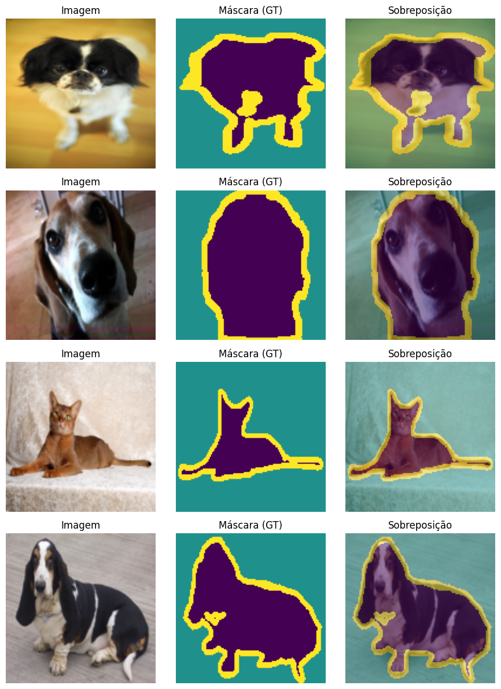
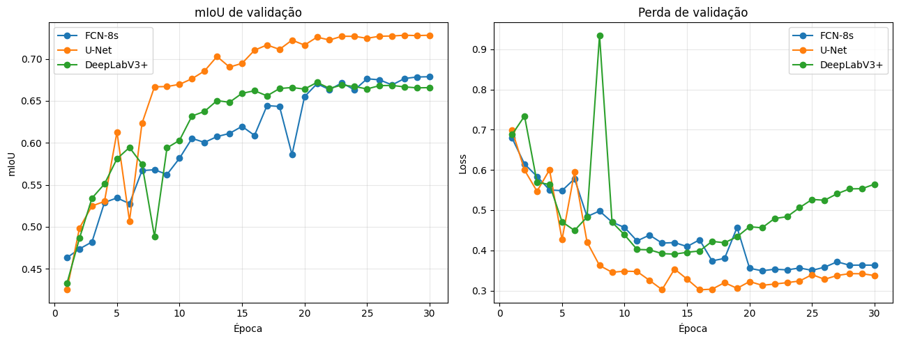
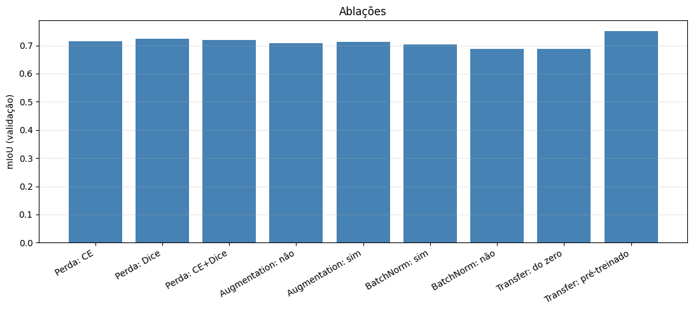
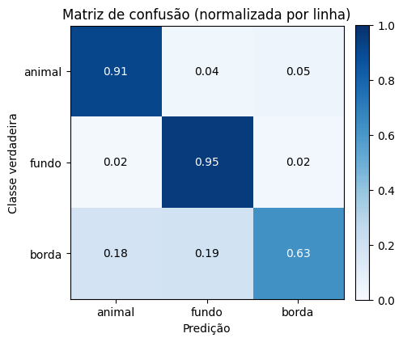
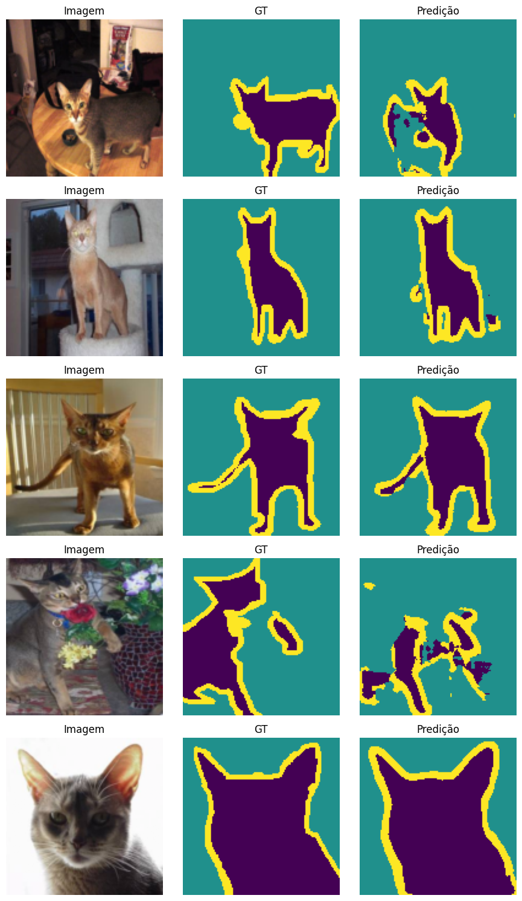

# Segmentação Semântica de Animais de Estimação com FCN-8s, U-Net e DeepLabV3+

**Disciplina:** Visão Computacional, UFMS

**Alunos:** Jerfferson Jorge e Rafael Tsutomu

---

## 1. Introdução

### Descrição do problema
O objetivo é fazer **segmentação semântica** de imagens de animais de estimação, ou seja, atribuir a **cada pixel** uma de três classes: **animal**, **fundo** e **borda** (o contorno do animal). Diferentemente da classificação de imagens (foco do Trabalho 2), a segmentação exige **predição densa** e preservação da estrutura espacial, o que torna a tarefa não trivial: é preciso **recuperar a resolução** perdida no encoder e **delimitar bem os contornos**. Mais do que maximizar uma métrica global, o trabalho investiga **o comportamento do modelo por classe e por arquitetura**: qual família de rede segmenta melhor, o que cada técnica acrescenta e por que a classe borda é tão difícil.

### Objetivo do trabalho
1. Implementar **três arquiteturas distintas** de segmentação (FCN-8s, U-Net e DeepLabV3+) e compará-las sob o **mesmo protocolo** de treino.
2. Realizar **quatro experimentos** de ablação na melhor arquitetura: função de perda, *data augmentation*, *Batch Normalization* e *transfer learning*.
3. Fazer uma **análise detalhada** dos resultados (por classe, matriz de confusão e distribuição por imagem), com métricas próprias de segmentação (mIoU, Dice e pixel accuracy).

---

## 2. Base de imagens

### Dataset Oxford-IIIT Pet
A base é a **Oxford-IIIT Pet**, carregada via `torchvision.datasets.OxfordIIITPet` com `target_types="segmentation"` (download automático). São **7.349 imagens** de **37 raças** de cães e gatos, cada uma com uma máscara *trimap* anotada **pixel a pixel**. Os valores originais do trimap (`1` animal, `2` fundo, `3` borda) foram **remapeados para `0/1/2`** para servirem de rótulo à `CrossEntropyLoss`. Usando o split oficial e separando treino/validação **80/20** com semente fixa (`seed=42`):

| Conjunto | Imagens |
|---|---|
| Treino | 2.944 |
| Validação | 736 |
| Teste | 3.669 |

A classe **borda** é, desde já, a mais problemática: ocupa **poucos pixels** e é uma faixa fina e ambígua de transição entre animal e fundo. A figura abaixo mostra exemplos do dataset (imagem, máscara *ground-truth* e sobreposição):

---

## 3. Metodologia

### Pré-processamento
- **Redimensionamento:** todas as imagens para **128×128**. As máscaras usam interpolação **nearest** (qualquer interpolação suave criaria rótulos inválidos entre classes); as imagens usam interpolação bilinear.
- **Normalização:** média `[0.485, 0.456, 0.406]` e desvio `[0.229, 0.224, 0.225]` (ImageNet), necessária para o encoder pré-treinado e adotada igual em **todos** os modelos para que a comparação seja justa.

### Divisão treino/validação/teste
Split oficial do dataset, com `trainval` dividido em **80/20** por um gerador semeado (`seed=42`), garantindo o **mesmo split** em todos os experimentos. O conjunto de **teste oficial** foi usado **apenas na avaliação final**.

### Arquiteturas
- **FCN-8s** (*baseline*): encoder estilo VGG, classificação por `Conv1×1` em baixa resolução e *upsampling* por `ConvTranspose2d` com **fusão aditiva** dos skips `pool3` e `pool4`. **20,50 M** parâmetros.
- **U-Net**: *encoder-decoder* simétrico com **skip connections por concatenação** em todos os níveis (`DoubleConv`, `Down`, `Up`, `OutConv`). **31,04 M** parâmetros.
- **DeepLabV3+**: *backbone* ResNet com **atrous convolutions** (*output stride* 16), módulo **ASPP** (contexto multi-escala) e *decoder* que funde *low-level features*. **16,60 M** parâmetros.

A inicialização de pesos é **Kaiming (He)** em todas as convoluções.

### Funções de perda
- **CrossEntropy** (`nn.CrossEntropyLoss`): baseline padrão de classificação por pixel.
- **Dice loss**: otimiza diretamente a **sobreposição** ($1 - \text{Dice}$); tende a ajudar classes raras como a borda.
- **CE+Dice**: soma das duas, unindo a estabilidade da CE ao foco em sobreposição do Dice.

### Estratégias de augmentation
Aplicadas **apenas no treino** e **sincronizadas** entre imagem e máscara (classe `JointTransform`): **flip horizontal**, **`RandomAffine`** (rotação ±15°, translação ±10%) e **`ColorJitter`** (brilho/contraste/saturação). A `ColorJitter` afeta **só a imagem**, pois alterar cor não faz sentido na máscara de rótulos.

### Hiperparâmetros
`Adam` (`lr=1e-3`), `CosineAnnealingLR`, `batch_size=16`, **30 épocas** no comparativo e **15 épocas** nas ablações, resolução `128×128`. Semente fixa (`SEED=42`) em `random`, `numpy` e `torch`. O melhor modelo de cada treino é guardado por **checkpoint** (maior mIoU de validação).

### Métricas usadas
Calculadas a partir de uma **matriz de confusão** acumulada: **IoU por classe** e **mIoU** (métrica principal), **Dice coefficient**, **pixel accuracy**, além de curvas de loss/mIoU por época e da **distribuição do mIoU por imagem**.

### Ferramentas e bibliotecas
**PyTorch** (CUDA), **torchvision** (dataset, transforms e pesos pré-treinados da ResNet-34), **NumPy** e **Matplotlib**. Implementamos as **três arquiteturas** (blocos e `forward`), as **perdas** Dice e CE+Dice, as **métricas** e o **laço de treino**; recorremos a bibliotecas apenas para as primitivas `nn.*`, o download do dataset, o otimizador/scheduler e os pesos pré-treinados (usados só na ablação de *transfer learning*). A distinção completa está no `PLANEJAMENTO.md`.

---

## 4. Experimentos

### Comparativo de arquiteturas
As três arquiteturas treinadas no **mesmo protocolo**: perda CrossEntropy, **30 épocas**, sem augmentation, `seed=42`. Comparadas por **mIoU, Dice e pixel accuracy**, número de parâmetros e tempo de treino.

### Ablações na melhor arquitetura
Sobre a melhor arquitetura do comparativo, variando **um fator por vez** (15 épocas, `seed=42`):
1. **Função de perda:** CE vs Dice vs CE+Dice.
2. **Data augmentation:** com vs sem.
3. **Batch Normalization:** com vs sem (`use_bn` da U-Net).
4. **Transfer learning:** encoder ResNet-34 **pré-treinado no ImageNet** vs **treinado do zero**.

---

## 5. Resultados

### Tabela-resumo do comparativo (validação, 30 épocas)

| Arquitetura | Params (M) | mIoU | Dice | Pixel acc | Tempo (s) |
|---|---|---|---|---|---|
| FCN-8s | 20,50 | 0,6788 | 0,7891 | 0,8731 | 710 |
| **U-Net** | 31,04 | **0,7282** | **0,8295** | **0,8961** | 1460 |
| DeepLabV3+ | 16,60 | 0,6720 | 0,7799 | 0,8640 | 583 |

### Análise do comparativo de arquiteturas
- **Melhor arquitetura.** A **U-Net venceu em todas as métricas** (mIoU **0,7282**), com a curva de validação consistentemente acima das demais a partir da **8ª época**. As *skip connections* densas, que recuperam bem os detalhes espaciais, explicam a vantagem em um dataset pequeno.
- **DeepLabV3+ e overfitting.** Convergiu rápido no início, mas sua **`val_loss` volta a subir após a 12ª época** (overfitting), e terminou **atrás da FCN-8s** em mIoU, mesmo sendo a arquitetura com **menos parâmetros** (16,60 M) e a **mais rápida** (583 s). Backbones tipo ResNet são mais dependentes de pré-treino e de mais dados.
- **FCN-8s.** Convergência mais **lenta e ruidosa** (queda visível de mIoU na 19ª época), estabilizando em **0,6788**.
- **Custo de treino.** Acompanha a profundidade efetiva: a U-Net foi a **mais cara** (1460 s), cerca do **dobro** das outras duas.

### Tabela-resumo das ablações (mIoU de validação, U-Net, 15 épocas)

| Experimento | mIoU |
|---|---|
| Perda: CE | 0,7139 |
| **Perda: Dice** | **0,7242** |
| Perda: CE+Dice | 0,7186 |
| Augmentation: não | 0,7070 |
| Augmentation: sim | 0,7114 |
| BatchNorm: sim | 0,7040 |
| BatchNorm: não | 0,6880 |
| Transfer: do zero | 0,6875 |
| **Transfer: pré-treinado** | **0,7507** |

### Análise das ablações
- **Função de perda.** A **Dice (0,7242)** superou CE+Dice (0,7186) e CE puro (0,7139): otimizar diretamente a sobreposição beneficiou o IoU.
- **Data augmentation.** Ganho **pequeno mas positivo** (0,7114 vs 0,7070); com só 15 épocas e dataset pequeno, o efeito regularizador ainda é modesto.
- **Batch Normalization.** **Ajudou claramente** (0,7040 com BN vs 0,6880 sem BN), acelerando e estabilizando o treino.
- **Transfer learning.** **Maior impacto de todos.** O encoder ResNet-34 **pré-treinado** atingiu **0,7507 em apenas 15 épocas**, superando inclusive a U-Net do zero treinada por **30 épocas** (0,7282). Como o mesmo encoder **sem** pré-treino ficou em 0,6875, o ganho vem do **pré-treino**, não da arquitetura do encoder.

### Avaliação final no conjunto de teste
A melhor arquitetura (**U-Net**, com os melhores pesos por mIoU de validação) foi avaliada no **teste oficial** (3.669 imagens, nunca vistas em treino/validação):

| Métrica | Valor |
|---|---|
| mIoU | **0,7408** |
| Dice | 0,8395 |
| Pixel accuracy | 0,9010 |

A IoU **por classe** deixa o contraste evidente: o **fundo** é o mais fácil (0,8995) e o **animal** é bem segmentado (0,8158), mas a **borda** é, de longe, a mais difícil (**0,5071**), e é ela que puxa o mIoU para baixo.

| Classe | IoU |
|---|---|
| animal | 0,8158 |
| fundo | 0,8995 |
| **borda** | **0,5071** |

### Matriz de confusão (teste, normalizada por linha)

O padrão confirma o diagnóstico: o **fundo acerta 95%** dos seus pixels e o **animal 91%**, ambos com pouca dispersão. Já a **borda acerta apenas 63%**, sendo confundida de forma **quase equilibrada** com animal (**18%**) e fundo (**19%**), exatamente o esperado para uma faixa estreita de transição entre as outras duas classes.

### Distribuição do mIoU por imagem
Além das métricas agregadas, medimos o mIoU de **cada uma das 3.669 imagens** do teste:

| Estatística (mIoU por imagem) | Valor |
|---|---|
| Média | 0,7356 |
| Mediana | 0,7625 |
| Desvio padrão | 0,1118 |
| Q25 a Q75 | 0,6859 a 0,8145 |
| Mínimo a Máximo | 0,0083 a 0,9098 |
| Imagens com mIoU > 0,7 | 2.613 (**71,2%**) |
| Imagens com mIoU > 0,8 | 1.198 (32,7%) |
| Imagens com mIoU < 0,5 | 153 (**4,2%**) |

O desempenho é **robusto**: **71,2%** das imagens passam de 0,7 de mIoU e apenas **4,2%** ficam abaixo de 0,5, ou seja, poucos casos de falha grave.

### Exemplos de predições

As predições reproduzem bem a **silhueta do animal** e a região de **fundo**. Os erros se concentram na **faixa de borda** e em cenas com **camuflagem/fundo complexo** (como na 4ª linha da figura), coerente tanto com a baixa IoU da borda quanto com os casos de mIoU mínimo da distribuição por imagem.

---

## 6. Discussão

### Quais foram os pontos fortes da solução?
O comparativo é **justo e reprodutível**: as três arquiteturas treinaram sob o **mesmo protocolo** e a **mesma semente**. Nesse cenário, a **U-Net** foi a melhor opção treinada do zero para um dataset pequeno, graças às suas *skip connections* densas. O **transfer learning** foi a alavanca **mais eficaz** (mIoU **0,7507** na metade das épocas), confirmando o valor de *features* pré-treinadas mesmo num domínio (animais) diferente do ImageNet. No geral, o desempenho foi bom: **pixel accuracy 0,9010** e **71,2%** das imagens do teste acima de 0,7 de mIoU.

### Quais foram as limitações do modelo?
A principal é a **classe borda** (IoU **0,5071**): poucos pixels e ambiguidade intrínseca do contorno. As perdas baseadas em Dice **ajudaram, mas não resolveram**. A **resolução 128×128** também limita o detalhamento dos contornos; resoluções maiores tendem a beneficiar justamente a borda, ao custo de tempo. Por fim, a **DeepLabV3+ do zero apresentou overfitting**, reforçando que backbones tipo ResNet pedem pré-treino e mais dados.

### Quais foram as principais dificuldades encontradas?
- **Sincronizar imagem e máscara** nas transformações geométricas, resolvido com a `JointTransform` e interpolação *nearest* na máscara.
- **Batch Normalization no pooling global do ASPP** com batches pequenos, mitigado com `drop_last=True` no treino e estatísticas acumuladas na avaliação.
- **Custo computacional** de treinar três arquiteturas por 30 épocas mais as nove ablações, o que exigiu **GPU** (Google Colab).

### Quais são as possíveis melhorias futuras?
1. **Combinar as duas melhores descobertas**: U-Net com **encoder pré-treinado + perda Dice**, treinada por mais épocas e em **256×256**.
2. **Backbone mais profundo** (ResNet-50 com atrous) e **Dice generalizada** (Sudre et al., 2017) ponderada por classe, para reforçar a borda.
3. **Pós-processamento de contornos** (CRF) e *augmentation* mais agressivo com mais épocas.

---

## 7. Conclusão

### Melhor modelo encontrado
Entre as arquiteturas treinadas do zero, a **U-Net** foi a melhor: no teste oficial alcançou **mIoU 0,7408**, **Dice 0,8395** e **pixel accuracy 0,9010**. Entre **todas** as configurações avaliadas, a de maior mIoU de validação foi a **U-Net com encoder ResNet-34 pré-treinado** (**0,7507**), que aponta o caminho da melhor solução final.

### Principais aprendizados
1. **Skip connections densas vencem em dados escassos.** A U-Net superou arquiteturas com mais contexto, porém mais dependentes de dados/pré-treino, como a DeepLabV3+.
2. **Transfer learning é a alavanca mais barata e eficaz**: melhor mIoU na metade das épocas, sem mudar a arquitetura.
3. **Batch Normalization é uma vitória barata**: acelerou e estabilizou o treino, com ganho de mIoU.
4. **Perdas baseadas em Dice ajudam o IoU**, sobretudo nas classes raras como a borda.
5. **A borda é o gargalo do problema** e o alvo mais promissor para trabalhos futuros.

---

## 8. Referências

1. Long, Jonathan, Evan Shelhamer, and Trevor Darrell. "Fully convolutional networks for semantic segmentation." Proceedings of the IEEE conference on computer vision and pattern recognition. 2015.
2. Ronneberger, Olaf, Philipp Fischer, and Thomas Brox. "U-net: Convolutional networks for biomedical image segmentation." International Conference on Medical image computing and computer-assisted intervention. Cham: Springer international publishing, 2015.
3. Chen, Liang-Chieh, et al. "Encoder-decoder with atrous separable convolution for semantic image segmentation." Proceedings of the European conference on computer vision (ECCV). 2018.
4. Sudre, Carole H., et al. "Generalised dice overlap as a deep learning loss function for highly unbalanced segmentations." International Workshop on Deep Learning in Medical Image Analysis. Cham: Springer International Publishing, 2017.
5. He, Kaiming, et al. "Deep residual learning for image recognition." Proceedings of the IEEE conference on computer vision and pattern recognition. 2016.
